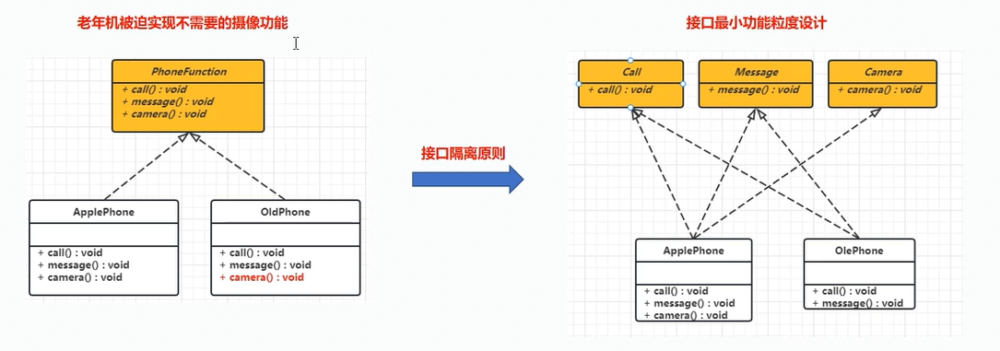
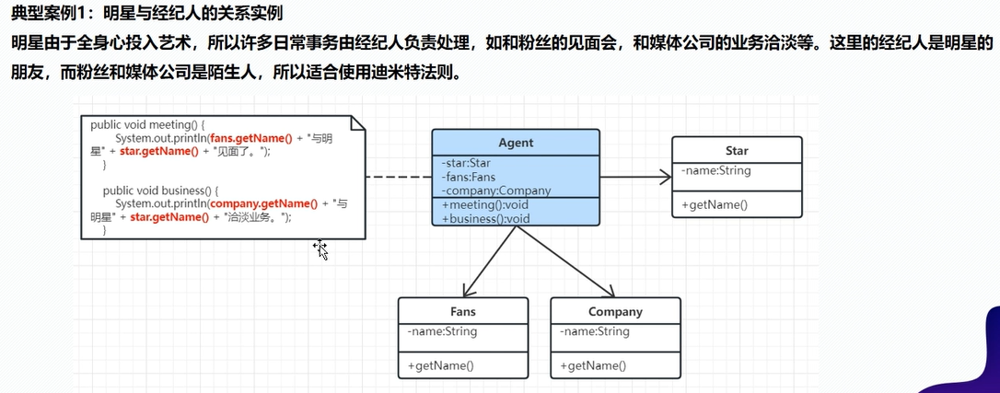
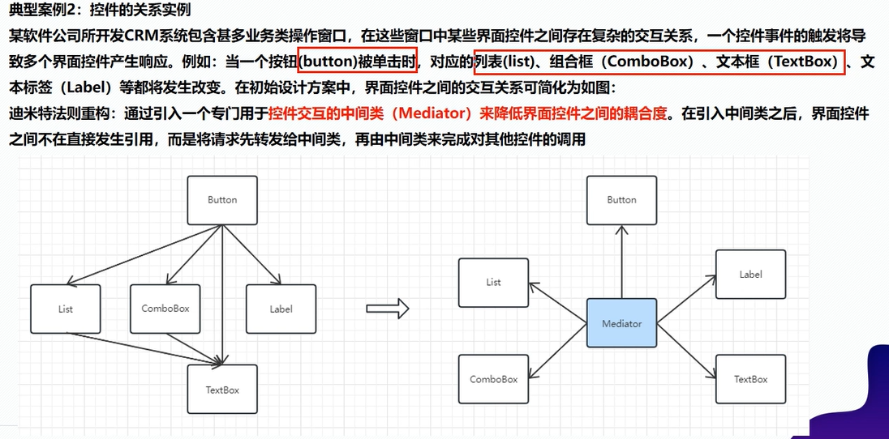
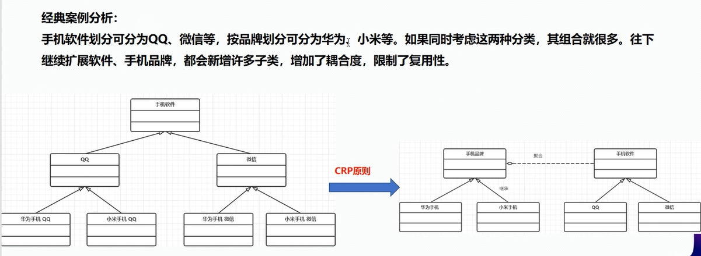

# 软件设计原则 1小时系列 （C++版）

[toc]


# 前言

> **申明**:
>
> 原视频：
>
> [面向对象-软件设计原则-1小时搞懂-波波酱老师_哔哩哔哩_bilibili](https://www.bilibili.com/video/BV1GG4y1Q7Bd/)
>
> 本文为up主的视频教学总结成文本和code
>
> 业主要是为了Cpper学习者学习。因为up在视频中使用的是java描述。

## 基本概念

1. 📌**可维护性质**

   在不破坏原有代码设计，不要引入新bug的情况下，能够快速修改或者添加代码

   **生活案例**：比如一个iPhone在维修摄像头的时候，如果一个手抖，就可能呆滞喇叭或者麦克风损坏，从而影响了通讯或者音视频功能，因为它们都集成在一个电路板上。但是，单反在维修的时候，就不存在这种情况‘

2. 📌**可扩展性**

   在不修改或者少量修改原有代码的情况下，可以通过扩展的方式添加新的功能代码

   **生活案例**：中秋到了，拿着iPhone想要拍个月亮发朋友圈，但是不管怎么拍，效果都不好。这个时候，只见隔壁老王把单发装在三脚架上，然后换上长焦镜头，“咔嚓”一声，我凑过去一看，“哇，真的是又大又圆啊！”。这个时候，单反可以根据不同的拍摄场景，扩展不同的镜头。

3. 📌**可复用性**

   尽量减少代码的重复编写，直接复用已有的代码

   **生活案例**：开发教务系统的时候，直接复用权限管理模块

4. 📌**内聚性**

   模块内部元素的紧密程度，内聚性越高，那么模块独立性越好，可维护性，复用性也越高

5. 📌**耦合性**

   模块与模块之间的关联关系，耦合度越高，那么模块与模块之间的关联越复杂，那么可维护性，复用性越差


# Design Principles

## ⭐单一职责原则

### (SRP) Single Responsibility Principle

一个类或者模块只负责完成一个职责（或者功能）。

通俗的讲，如果这个类包含两个或者多个不相干的功能，那么这个类的职责就不够单一，应该将它**拆分成多个功能更加单一，粒度更细的类**。

单一职责原则是实现**高内聚，低耦合**的指导方针，它是**最简单但又最难运用**的原则，需要设计人员发现类的不同职责并将其分离，而发现类的多重职责需要设计人员具有较强的分析设计能力和相关实现经验。

### Code


**old**

```cpp
#include <iostream>
#include <string>

class UserInfo {
private:
    long userID;
    std::string userName;
    std::string phone;
    std::string province;
    std::string city;
    std::string region;
    std::string detailAddress;

public:
    void save() {
        std::cout << "save user information" << std::endl;
    }

    void saveAddress() {
        std::cout << "save address information" << std::endl;
    }
};
```

**new**

```cpp
#include <iostream>
#include <list>
#include <string>

class Address {
private:
    std::string city;
    std::string region;
    std::string detailAddress;

public:
    void saveAddress() {
        std::cout << "save address information" << std::endl;
    }
};

class UserInfo {
private:
    long userID;
    std::string userName;
    std::string phone;
    std::string province;
    std::list<Address> addressList;

public:
    void save() {
        std::cout << "save user information" << std::endl;
    }
};
```


## ⭐里氏替换原则

### (LSP) Liskov Substitution Principle

**子类对象能够替换程序中父类对象出现的任何地方**，并且保证原来程序的瑞吉行为不变及正确性不被破快。

通俗理解：子类可以扩展父类的功能，但不改变父类原有的功能。

换句话说，**子类继承父类时，除添加新的方法完成新功能外，尽量不要重写父类的方法**，如果重写父类方法，**程序运行会发生出错概率**。

如果一定要用多态，那么父类可以设计成抽象父类或者接口。

### Code


**old**

```cpp
#include <iostream>

// 接口过于庞大
class PhoneFunction {
public:
    virtual void call() = 0;
    virtual void message() = 0;
    virtual void camera() = 0;
};

class ApplePhone : public PhoneFunction {
public:
    virtual void call() override {
        std::cout << "Apple " << __func__ << std::endl;
    }
    virtual void message() override {
        std::cout << "Apple " << __func__ << std::endl;
    }
    virtual void camera() override {
        std::cout << "Apple " << __func__ << std::endl;
    }
};

class OldPhone : public PhoneFunction {
public:
    virtual void call() override {
        std::cout << "Old " << __func__ << std::endl;
    }
    virtual void message() override {
        std::cout << "Old " << __func__ << std::endl;
    }
    virtual void camera() override {
        std::cout << "Old " << __func__ << std::endl;
    }
};
```

**new**

```cpp
#include <iostream>

// 接口粒度最小
struct Call {
    virtual void call() = 0;
};

struct Message {
    virtual void message() = 0;
};

struct Camera {
    virtual void camera() = 0;
};

class ApplePhone : public Call, public Message, public Camera {
public:
    virtual void call() override {
        std::cout << "Apple " << __func__ << std::endl;
    }
    virtual void message() override {
        std::cout << "Apple " << __func__ << std::endl;
    }
    virtual void camera() override {
        std::cout << "Apple " << __func__ << std::endl;
    }
};

class OldPhone : public Call, public Message {
public:
    virtual void call() override {
        std::cout << "Old " << __func__ << std::endl;
    }
    virtual void message() override {
        std::cout << "Old " << __func__ << std::endl;
    }
};
```


## ⭐开闭原则

### (OCP) Open Closed Principle

**对扩展开放，对修改关闭**。

在程序需要进行拓展的时候，不要去修改原有代码，实现一个**热拔插**的效果。

简而言之，是为了使程序的扩展性好，易于维护与升级。

想要达到这样的效果，我们需要使用**接口和抽象类**。

因为抽象灵活性好，适应性广，只要抽象的合理，可以基本保持软件架构的稳定。

而软件中异变的细节可以从抽象派生的实现类来进行扩展，当软件需要发生变化时，只需要根据需求派生一个实现类来扩展就可以了。

### Code


**old**

```cpp
#include <ctime>
#include <iostream>
#include <string>

class Equation {
protected:
    int leftNum;
    int rightNum;
    int result;
    std::string op;

public:
    std::string toString() {
        return std::to_string(leftNum) + op + std::to_string(rightNum) + "=" +
               std::to_string(result);
    }

    int generateRandom(int min, int max) {
        return rand() % (max - min + 1) + min;
    }

    Equation generateEquation(std::string op) {
        leftNum = generateRandom(0, 100);
        rightNum = generateRandom(0, 100);
        if (op == "+") {
            result = leftNum + rightNum;
        } else if (op == "-") {
            result = leftNum - rightNum;
        }
        this->op = op;
        return *this;
    }
};

int main() {
    srand(time(0));
    Equation equation = Equation().generateEquation("-");
    std::cout << equation.toString() << std::endl;
}
```

**new**

```cpp
#include <ctime>
#include <iostream>
#include <string>

class Equation {
protected:
    int leftNum;
    int rightNum;
    int result;
    std::string op;

public:
    std::string toString() {
        return std::to_string(leftNum) + op + std::to_string(rightNum) + "=" +
               std::to_string(result);
    }

    int generateRandom(int min, int max) {
        return rand() % (max - min + 1) + min;
    }

    // 抽象方法
    // 注意，C++中，抽象基类无法实例化，因此无法直接返回`Equation`
    virtual Equation* generateEquation() = 0;
};

class AddEquation : public Equation {
public:
    Equation* generateEquation() override {
        leftNum = generateRandom(0, 100);
        rightNum = generateRandom(0, 100);
        result = leftNum + rightNum;
        this->op = "+";
        return this;
    }
};

class SubEquation : public Equation {
public:
    Equation* generateEquation() override {
        leftNum = generateRandom(0, 100);
        rightNum = generateRandom(0, 100);
        result = leftNum - rightNum;
        this->op = "-";
        return this;
    }
};

int main() {
    srand(time(0));
    // 多态
    Equation* equation = (new SubEquation())->generateEquation();
    std::cout << equation->toString() << std::endl;
    delete equation;

    equation = (new AddEquation())->generateEquation();
    std::cout << equation->toString() << std::endl;
    delete equation;
}
```


## ⭐依赖倒置原则

###  (DIP) Dependency Inversion Principle

模块之间要**依赖抽象，不依赖实现，要面向接口编程，不要面向实现编程**。

高层模块不应该直接依赖底层模块，这样就降低了客户端与实现模块间的耦合。

### Code


**old**

```cpp
#include <iostream>

class IntelCpu {
public:
    void calculate() {
        std::cout << "IntelCpu " << __func__ << std::endl;
    }
};

class IntelMemory {
public:
    void storage() {
        std::cout << "IntelMemory " << __func__ << std::endl;
    }
};

class Computer {
private:
    IntelCpu intelCpu;
    IntelMemory intelMemory;

public:
    Computer() {
    }
    Computer(IntelCpu intelCpu, IntelMemory intelMemory) {
        this->intelCpu = intelCpu;
        this->intelMemory = intelMemory;
    }

    void startRun() {
        intelCpu.calculate();
        intelMemory.storage();
    }
};

int main() {
    IntelCpu intelCpu;
    IntelMemory intelMemory;
    Computer computer(intelCpu, intelMemory);
    computer.startRun();
}
```


**new**

```cpp
#include <iostream>

class Cup {
public:
    virtual void calculate() = 0;
};

class Memory {
public:
    virtual void storage() = 0;
};

class IntelCpu : public Cup {
public:
    void calculate() override {
        std::cout << "IntelCpu " << __func__ << std::endl;
    }
};

class IntelMemory : public Memory {
public:
    void storage() override {
        std::cout << "IntelMemory " << __func__ << std::endl;
    }
};

class AmdCpu : public Cup {
public:
    void calculate() override {
        std::cout << "AmdCpu " << __func__ << std::endl;
    }
};

class AmdMemory : public Memory {
public:
    void storage() override {
        std::cout << "AmdMemory " << __func__ << std::endl;
    }
};

class Computer {
private:
    Cup* cpu;
    Memory* memory;

public:
    Computer() {
    }
    Computer(Cup* cpu, Memory* memory) {
        this->cpu = cpu;
        this->memory = memory;
    }

    void startRun() {
        cpu->calculate();
        memory->storage();
    }
};

int main() {
    Computer computer;

    IntelCpu intelCpu;
    IntelMemory intelMemory;
    computer = Computer(&intelCpu, &intelMemory);
    computer.startRun();

    AmdCpu amdCpu;
    AmdMemory amdMemory;
    computer = Computer(&amdCpu, &amdMemory);
    computer.startRun();
}
```


## ⭐接口隔离原则

### (ISP) Interface Segregation Principle

客户端不应该被迫依赖于它不适用的方法，一个类对于另一个类的依赖应该建立在最小的接口上。

一个类实现一个接口，就必须实现这个接口的所有抽象方法，如果接口的设计过于庞大的话，实现类就被迫实现不需要的抽象方法。

### Code


**old**

```cpp
#include <iostream>

class Bird {
protected:
    double runSpeed;
    double flySpeed;

public:
    virtual void setRunSpeed(double runSpeed) {
        this->runSpeed = runSpeed;
    }

    virtual void setFlySpeed(double flySpeed) {
        this->flySpeed = flySpeed;
    }

    double calcFlyTime(double distance) {
        return distance / flySpeed;
    }

    double calcRunTime(double distance) {
        return distance / runSpeed;
    }
};

class Parrot : public Bird {
public:
    void studySpeak() {
        std::cout << __func__ << std::endl;
    }
};

class Ostrich : public Bird {
public:
    virtual void setFlySpeed(double flySpeed) override {
        this->flySpeed = 0;
    }
};

int main() {
    Bird* parrot = new Parrot();
    parrot->setFlySpeed(150.0);
    std::cout << "fly 300km" << std::endl;
    std::cout << "parrot uses " << parrot->calcFlyTime(300.0) << " hours"
              << std::endl;

    Bird* ostrich = new Ostrich();
    ostrich->setFlySpeed(150.0);
    std::cout << "fly 300km" << std::endl;
    std::cout << "ostrich uses " << ostrich->calcFlyTime(300.0) << " hours"
              << std::endl;
}
```



**new**

```cpp
#include <iostream>

class Bird {
protected:
    double runSpeed;
    double flySpeed;

public:
    virtual void setRunSpeed(double runSpeed) {
        this->runSpeed = runSpeed;
    }

    virtual void setFlySpeed(double flySpeed) {
        this->flySpeed = flySpeed;
    }

    double calcFlyTime(double distance) {
        return distance / flySpeed;
    }

    double calcRunTime(double distance) {
        return distance / runSpeed;
    }
};

class Parrot : public Bird {
public:
    void studySpeak() {
        std::cout << __func__ << std::endl;
    }
};

class Ostrich : public Bird {
public:
    virtual void setFlySpeed(double flySpeed) override {
        this->flySpeed = 0;
    }
};

int main() {
    Bird* parrot = new Parrot();
    parrot->setFlySpeed(150.0);
    std::cout << "fly 300km" << std::endl;
    std::cout << "parrot uses " << parrot->calcFlyTime(300.0) << " hours"
              << std::endl;

    Bird* ostrich = new Ostrich();
    ostrich->setFlySpeed(150.0);
    std::cout << "fly 300km" << std::endl;
    std::cout << "ostrich uses " << ostrich->calcFlyTime(300.0) << " hours"
              << std::endl;
}
```


## ⭐迪米特法则

### (LOD) Law of Demeter

迪米特法则来自于1987年美国东北大学的一个名为Demeter的一个项目，**只跟朋友联系，不跟“陌生人”说话**。

如果两个软件实体无须直接通信，那么就不应该发生直接的互相调用，可以通过第三方转发该调用。

其目的是降低类之间的耦合度，提高模块的相对独立性。

### 无具体Code

> 无具体code
>
> 这个发展在项目中的各个模块调用非常之多，需要多项目，业务非常熟悉才能搭建良好的结构。






## ⭐合成复用原则

### (CRP) Composite Reuse Principle

**尽量先适用组合或者聚合等关联关系来实现，其次才考虑使用继承关系来实现**。

通常类的复用分为继承复用和合成复用两种。

继承复用虽然简单和易实现的优点，但它也存在以下缺点：

1. 继承复用破坏了类的封装性。因为继承会**将父类的实现细节暴露给子类**，父类对子类是透明的，所以这种复用又称为”**白箱**“复用。
2. 子类与父类的**耦合度高。父类的实现的任何改变都会导致子类的实现发生变化**，这不利于类的扩展和维护。

<u>采用组合或聚合复用时，可以将已有的对象纳入新对象中，使之成功新对象的一部分</u>，新对象可以调用已有对象的功能，它有以下优点：

1. 它维持了类的封装性。因为成分对象的内部细节是新对象看不见的，所以这种复用又称”**黑箱**“复用。
2. 对象间的**耦合度低**。可以在类的成员位置声明抽象（**抽象类或者接口**）

### Code




**old**

```cpp
#include <iostream>
#include <string>

class A {
protected:
    std::string name;
    int age;

public:
    void methodA() {
        std::cout << "A " << __func__ << std::endl;
    }
};

class B : public A {
public:
    void methodB() {
        std::cout << "B " << __func__ << std::endl;
    }
};

int main() {
    B b;
    b.methodA();
    b.methodB();
}
```

**new**

```cpp
#include <iostream>
#include <string>

class A {
protected:
    std::string name;
    int age;

public:
    void methodA() {
        std::cout << "A " << __func__ << std::endl;
    }
};

class B : public A {
public:
    void methodB() {
        std::cout << "B " << __func__ << std::endl;
    }
};

int main() {
    B b;
    b.methodA();
    b.methodB();
}
```


---

---

---

# END

## [设计模式 李建忠 C++](https://blog.csdn.net/CUBE_lotus/article/details/128322904)

## 敏捷软件开发 - 面向对象设计的原则

在敏捷软件开发中提出了以下设计原则

**SRP 单一职责原则**

就一个类而言，应该仅有一个引起它变化的原因

**OCP 开放封闭原则**

软件实体（类、模块、函数等）应该是可以扩展的，但是不可修改

**LSP Liskov替换原则**

子类型必须能替换换他们的基本类型

**DIP 依赖倒置原则**

抽象不应该依赖细节。细节应该依赖于抽象。

**ISP 接口隔离原则**

不应该强迫客户依赖于他们不用的方法。接口属于客户，不属于他所在的类层次结构。

**REP 重用发布等价原则**

重用的粒度就是发布的粒度

**CCP 共用重用原则**

一个包中的所有类应该是共用重用的。如果重用了包中的一个类，那么就重用包中的所有类。互相之间没有紧密联系的类不应该在同一个包中。

**CRP 共用封闭原则**

一个包中的所有类对于同一个类性质的变化应该是共同封闭的。一个变化若对一个包影响，则将对包中的所有类产生影响，而对其他的包不造成任何影响。

**ADP 无依赖原则**

在包的依赖关系中不存在环。细节不应该被依赖。

**SDP 稳定依赖原则**

朝着稳定的方向依赖。

**ASP 稳定抽象原则**

一个包的抽象程度应该和其他稳定程度一致。

